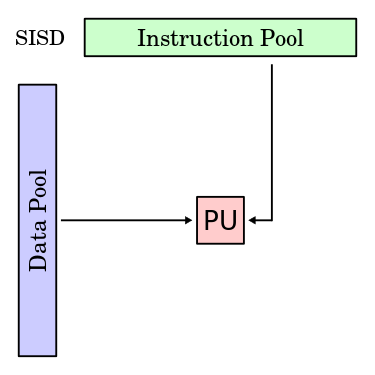
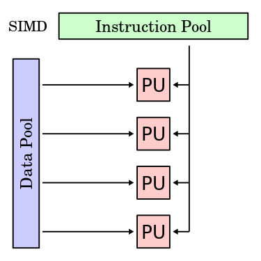
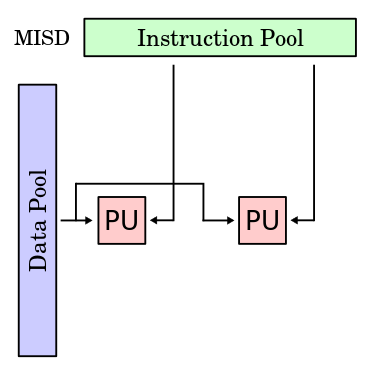
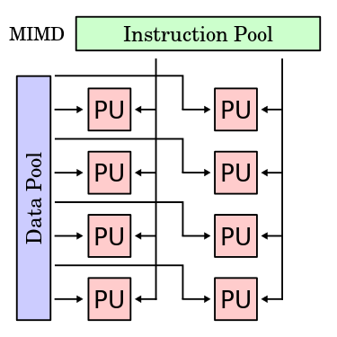
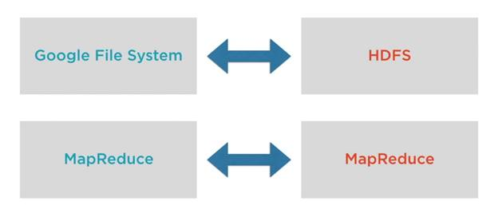

#Big Data
*Assignment No.2*

---

*By:*

Karnjot Singh

1311079

---

##Q1 Explain Parallel Computing ,Distributed Computing , Cloud Computing ,Grid Computing,Cluster Computing?

---

>####Parallel Computing

*Parallel Computing* is a type of computation in which many calculations or the execution of processes are carried out simultaneosly.

Large problems can often be divided into smaller ones, which can then be solved at the same time.

----

There are several different forms of parallel computing: 

* Bit-level: It means many bit are processed in parallel like  8bit- processor.
* Instruction-level: It means many of the instructions in a computer program can be executed simultaneously.

    * Hardware Level: Dynamic Parallelism
    * Software LeveL: Static Parallelism

* Data: Data is processed in parallel.
* Task parallelism: It is a form of parallelization of computer code across multiple processors in parallel computing environments.

----

In Parallel Computing,

* Tightly coupled processes.
* All the different processors have shared memory.

---

>####Distributed Computing

*Distributed Computing* is a field of computing science that studies distributed systems. In distributed computing, a problem is divided into many tasks, each of which is solved by one or more computers, which communicate with each other by message passing.

----

A distributed system is a model in which components located on networked computers communincate and coordinate their actions by passing messages. The components interact with each other in order to achieve a common goal.

----

In distributed computing,

* All the different processors have their own private non-shareable memory.
* Processes share information through message passing.
* Failure of one processes doesn't effects other. 
* Lack of global clock.

---

>####Cloud Computing

Cloud computing is a type of Internet-based computing that provides shared computer processing resources and data to computers and other devices on demand.

Type of services provided by cloud computing:
* Infrastructure as a Service (IaaS)
* Platform as a Service (PaaS)
* Software as a Service (SaaS).

----

* Provides services over the network.
* Single system view.
* It is a centralized model controlled by some master server.
* It is often owned by one company and is used to offer services to the users.
* Examples: AWS, Gmail, Facebook, etc.

---

>####Grid Computing

*Grid computing* is the collection of computer resources from multiple locations to reach a common goal. The grid can be thought of as a distributed system with non-interactive workloads that involve a large number of files. Grid computing is distinguished from conventional high performance computing systems such as cluster computing in that grid computers have each node set to perform a different task/application. Grid computers also tend to be more heterogeneous and geographically dispersed (thus not physically coupled) than cluster computers.

----

* Machines are spread geographically, connected together to crunch away at big problems.
* Each node preform heterogenous task.
* It is a decentralized model.
* Often multiple companies collaborate in order to aggregate the computing power.
* The machines are loosely coupled hence the user does not get a single system view.
* Examples: SETI (Search for Extra Terrestial Intelligence)

---

>####Cluster Computing

A computer cluster consists of a set of tightly connected computers that work together so that, in many respects, they can be viewed as a single system. Unlike grid computers, computer clusters have each node set to perfor the same task, controlled and scheduled by software.

----

* All computers perform same task.
* Machines are connected locally and coordinated via some protocol governed by a software running from a master node.
* The network is tightly coupled.
* Centralized.
* Single system image to the user.
* Examples: Hadoop and other big data solutions.

---

>###Flynn's Texonomy

Flynn's taxonomy is a classification of **computer architectures**, proposed by **Michael J. Flynn** in 1996.

The classification system is used to design modern processors and their functionalities.

----

>####Classifications

The four classifications defined by Flynn are based upon the number of concurrent instruction (or control) streams and data streams available in the architecture.

1. Single instruction stream, single data stream (SISD)
2. Single instruction stream, multiple data stream (SIMD)
    1. Single instruction, multiple threads (SIMT)
4. Multiple instructions streams, single data stream (MISD)
5. Multiple instructions streams, multiple data streams (MIMD)

---

>####SISD

A sequential computer which exploits no parallelism in either the instruction or data streams. Single control unit (CU) fetches single instruction stream (IS) from memory. The CU then generates appropriate control signals to direct single processing element (PE) to operate on single data steam (DS) i.e., one operation at a time.

----



----

>####SIMD

A computer which exploits multiple data streams against a single instruction stream to perform operations which may be naturally parallelized. For example, an array processor or graphics processing unit (GPU).

----



----

>####SIMT

Single instruction, multiple threads (SIMT) is an execution model used in parallel computing where single instruction, multiple data (SIMD) is combined with multithreading.

----

>####MISD

Multiple instructions operate on one data stream. Uncommon architecture which is generally used for fault tolerance. Heterogeneous systems operate on the same data stream and must agree on the result. Examples include the Space Shuttle flight control computer.

----



----

>####MIMD

Multiple autonomous processors simultaneously executing different instructions on different data. MIMD architectures include multi-core superscalar processors, and distributed systems, using either one shared memory space or a distributed memory space.

----



---

>###Why the current era require huge computational power?

----

1. To process ever increasing sources for data generation.
2. To gain knowledge from ever increasing knowledge.
3. To manage and understand variety and volume of data.
4. To predict things.
5. To solve big scientific problems.
6. Computers are being used to crunch away at problems varrying from medicine, intelligence to even the cosmos.
7. To find the patterns in seemingly random world.

---

##Q2 What are licences.Explain its Significance and Types. 

A licence is an official permission or permit to do, use, or own something (as well as the document of that permission or permit).

A license may be granted by a party ("licensor") to another party ("licensee") as an element of an agreement between those parties. A shorthand definition of a license is "an authorization (by the licensor) to use the licensed material (by the licensee)."

In particular, a license may be issued by authorities, to allow an activity that would otherwise be forbidden. It may require paying a fee or proving a capability. The requirement may also serve to keep the authorities informed on a type of activity, and to give them the opportunity to set conditions and limitations.

A licensor may grant a license under intellectual property laws to authorize a use (such as copying software or using a (patented) invention) to a licensee, sparing the licensee from a claim of infringement brought by the licensor. A license under intellectual property commonly has several components beyond the grant itself, including a term, territory, renewal provisions, and other limitations deemed vital to the licensor.

* Term: many licenses are valid for a particular length of time. This protects the licensor should the value of the license increase, or market conditions change. It also preserves enforceability by ensuring that no license extends beyond the term of the agreement.

* Territory: a license may stipulate what territory the rights pertain to. For example, a license with a territory limited to "North America" (Mexico/United States/Canada) would not permit a licensee any protection from actions for use in Japan.

A shorthand definition of license is "a promise by the licensor not to sue the licensee." That means without a license any use or exploitation of intellectual property by a third party would amount to copying or infringement. Such copying would be improper and could, by using the legal system, be stopped if the intellectual property owner wanted to do so.

Intellectual property licensing plays a major role in business, academia and broadcasting. Business practices such as franchising, technology transfer, publication and character merchandising entirely depend on the licensing of intellectual property. Land licensing (proprietary licensing) and IP licensing form sub-branches of law born out of the interplay of general laws of contract and specific principles and statutory laws relating to these respective assets.

## Types of Software licenses

* Proprietary license: Most software licenses are "proprietary" licenses, meaning the software publisher grants a license to use one or more copies of software, but that ownership of those copies remains with the software publisher. The user must accept the license before they are permitted to use the software.

* GNU General Public License;These are agreements under which much "open source" software is licensed. End users may do things like change the source code, but any refinements of the software must also be made available under a GNU GPL license. Often referred to as "free, copyleft" licenses, the software may or may not be distributed for a fee - "free" refers to the ability of users to change and distribute modifications of the software, not to cost. See the GNU General Public License web page for more information.

* End User License Agreement (EULA): Also called "clickwraps" or "shrinkwraps," EULAS indicate the terms under which the end-user may use the software. Agreements with organizations or companies often take the form of contracts between the organization and the software publisher or vendor, and specify the terms of use for all users from the organization, superseding any EULAs which may come with the software.

* Workstation licenses: These are licenses that permit the installation of an application on a single computer. You may not install the software on more than one machine unless you purchase a license for each additional machine. Most workstation license agreements allow you to make a single backup copy of the software as long as that backup copy is used only to restore the software onto the same machine, or a separate machine if the software is removed from the original computer.

* Concurrent use license: These are licenses that permit you to install the software onto multiple machines as long as the number of computers using the software at the same time does not exceed the number of licenses which you have purchased. Concurrent use licenses are usually used in conjunction with "license manager" software that prevents the number of licenses from being exceeded. At UNCG, ITS uses KeyServer software that monitors and controls the use of concurrent use licensed software.

* Site licenses: A site license permits the use of software on any computer at a specified site. Unlimited site licenses allow the installation of software on any number of computers as long as those computers are located at the specified site. Some site licenses permit the installation on computers owned by a particular entity (such as a university) regardless of the physical location. Some vendors refer to their licenses as site licenses but restrict the number of computers on which the software may be installed. The only way to know for sure is to read the license specifics.

* Perpetual licenses: These are licenses without expiration dates, which permit use of the software indefinitely, without requiring a recurring fee for continued use. Most software that individuals buy for use on their home computers are perpetual licenses.

* Non-perpetual licenses: These are licenses that "lease" the software for use for a specified period of time, usually annually or sometimes bi-annually. Users are required to remove the software from their computer if they cease paying the license fee.

* License with Maintenance: Some license agreements allow the user to purchase "maintenance" or "software assurance" along with the original license fee, which entitles the user to receive new versions of the software for one to two years until the maintenance agreement expires.

##Significance

Businesses must be savvy in the licenses they purchase to ensure firstly they are using software legally and secondly, they aren’t paying for licenses that aren’t being used. By acquiring too many software licenses you’re wasting company resources, without enough you leave yourself liable to a potential lawsuit (which is quite costly). Finding the right license agreement can also make it easier to manage software in your company.

---

## Q3 Make XML to JSON converter.


```

import simplejson as json

#Need to install lxml using sudo apt-get install python-lxml in ubuntu

import lxml

class objectJSONEncoder(json.JSONEncoder):
    
    model = (
        (lxml.objectify.IntElement, int),
        (lxml.objectify.NumberElement, float),
        (lxml.objectify.FloatElement, float),
        (lxml.objectify.ObjectifiedDataElement,
            lambda s: unicode(s).strip().encode('utf-8')),
    )
    
    def default(self,o):
        for o_type, constructor in self.model:
            if isinstance(o, o_type):
                return constructor(o)
        if hasattr(o, '__dict__'):
            #For objects with a __dict__, return the encoding of the __dict__
            return [item.__dict__ for item in o]
return json.JSONEncoder.default(self, o)

if __name__ == "__main__":
    from lxml import objectify
    obj = objectify.fromstring("<Book><price>1.50</price><author>W. Shakespeare</author></Book>")
    json.dumps(obj, cls=objectJSONEncoder)
    
```
#### Output:
'{"price": 1.5, "author": "W. Shakespeare"}'

---

##Q2 What are differences/ similarities between Hadoop and Distributed systems? 

Working with distributed systems needs software which can coordinate and manage the processors and machines within the distributed environment. As the scaling of giant corporations like Google keeps on increasing, they started to build new software that can run on all the distributed systems.

Objective of the software that was developed for distributed systems will be, as shown below.

1. Store millions of records (raw data) on multiple machines, so keeping records on what record exists on which node within the data center.
2.	How do we run the processes on all these machines to simplify the data?

Thus, Google worked on these two concepts and they designed the software for this purpose.

*	Google File System was used to store the data in a distributed manner and to solve the distributed storage.
*	Map Reduce was used to solve the distributed computing running across multiple machines and to bring in data running across multiple machines to hop in something useful.
	
Both of these combine together to work in Hadoop.



Google File System works namely as Hadoop Distributed File System and Map Reduce is the Map Reduce algorithm that we have in Hadoop. Hence, HDFS and MapReduce join together with Hadoop for us. 

HDFS is a file system that is used to manage the storage of the data across machines in a cluster. Perhaps MapReduce is a framework to process the data across the multiple Servers. Hadoop is distributed by Apache Software foundation whereas it’s an open source.

In 2013, MapReduce into Hadoop was broken into two logics, as shown below.

1.	MapReduce
2.	YARN

Now, MapReduce framework is to just define the data processing task. It was focused on what logic that the raw data has to be focused on.

YARN is a framework again, which will be running the data processing task across the multiple machines, managing memory, managing processing etc.

---

## Q5 Classify the data having information about student .


```

from sklearn import datasets
from sklearn.cross_validation import train_test_split

import pandas as pd
mydata = pd.read_csv("data")
target = mydata["Label"]  #provided your csv has header row, and the label column is named "Label"

#select all but the last column as data
data = mydata.ix[:,:-1]


x_train, x_test, y_train, y_test=train_test_split(
    data, target, test_size=0.2)

# Fit and predict.
from sklearn.neighbors import KNeighborsClassifier
classifier= KNeighborsClassifier()
classifier.fit(x_train, y_train)
predictions = classifier.predict(x_test)

print predictions

```


###Here, Input should be in file with name data in following CSV format:

```

Male|female, Height,Color,Label
1,4.5,255, 1


```


>>#*THANK YOU.*
